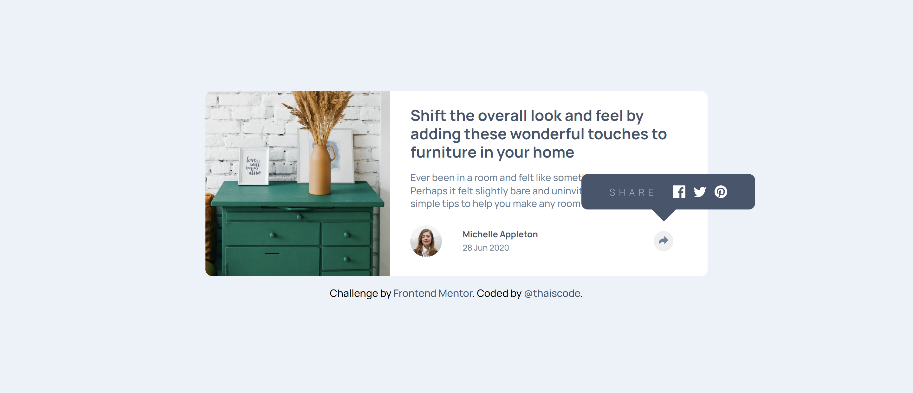
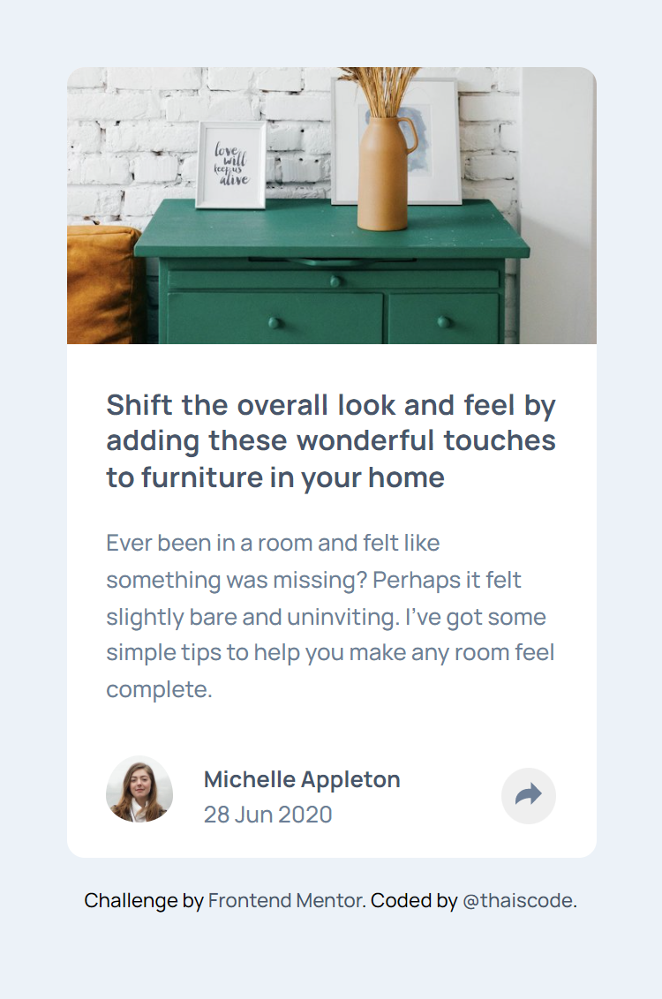
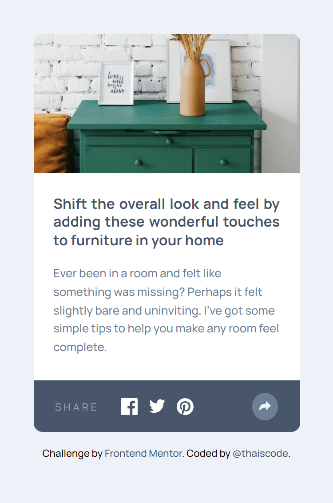

# Frontend Mentor - Article preview component solution

This is a solution to the [Article preview component challenge on Frontend Mentor](https://www.frontendmentor.io/challenges/article-preview-component-dYBN_pYFT). Frontend Mentor challenges help you improve your coding skills by building realistic projects. 

## Table of contents

- [Overview](#overview)
  - [The challenge](#the-challenge)
  - [Screenshot](#screenshot)
  - [Links](#links)
- [My process](#my-process)
  - [Built with](#built-with)
  - [What I learned](#what-i-learned)
  - [Continued development](#continued-development)
  - [Useful resources](#useful-resources)
- [Author](#author)

## Overview

### The challenge

Users should be able to:

- View the optimal layout for the component depending on their device's screen size
- See the social media share links when they click the share icon

### Screenshot

### Links

- Solution URL: [Add solution URL here](https://your-solution-url.com)
- Live Site URL: [Add live site URL here](https://your-live-site-url.com)

## My process

### Built with

- Semantic HTML5 markup
- CSS custom properties
- Flexbox
- Mobile-first workflow
- JS vanilla
- BEM

### What I learned

In this challenge I was able to better understand how the "object-fit" works.

### Continued development

I will continue to focus my studies on vanilla js, to better learn the basics of the language before starting to learn a framework.

### Useful resources

- [MDN](https://developer.mozilla.org) - All my doubts were cleared by MDN.

## Author

- Website - [thaiscode](https://github.com/thaiscode)
- Frontend Mentor - [@thaiscode](https://www.frontendmentor.io/profile/thaiscode)

